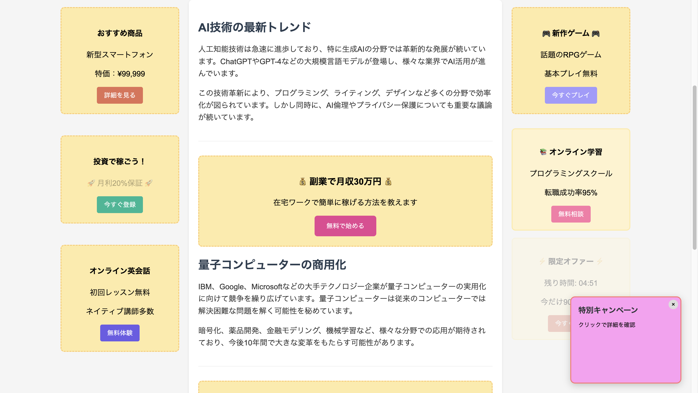
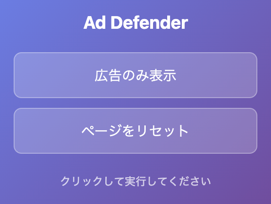
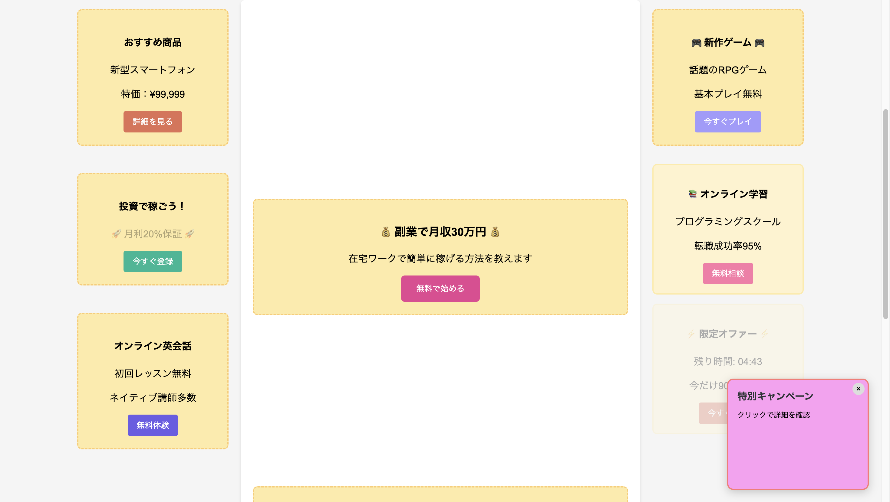

# Ad Defender


> **広告のみを表示するChrome拡張機能** - ウェブページ上の広告以外の要素を非表示にして、広告コンテンツのみを表示します。ジョーク拡張機能です。

## 概要

Ad Defenderは、ウェブページ上の広告要素を識別し、それ以外のコンテンツを非表示にするユニークなChrome拡張機能です。通常のアドブロッカーとは逆の動作で、完全にジョーク用の拡張機能です。

### 主な機能

- **高精度な広告検出**: 複数の検出ロジックで広告要素を特定
- **ワンクリック実行**: 拡張機能アイコンをクリックするだけで実行
- **簡単リセット**: ページを元の状態に戻すことが可能
- **美しいUI**: モダンなグラデーションデザインのポップアップ

## インストール方法


### 手動インストール（開発者モード）

1. このリポジトリをクローンまたはダウンロード
   ```bash
   git clone https://github.com/Akkie314/AdDefender
   ```

2. Chromeを開き、`chrome://extensions/` にアクセス

3. 右上の「デベロッパーモード」を有効にする

4. 「パッケージ化されていない拡張機能を読み込む」をクリック

5. ダウンロードしたフォルダを選択

6. 拡張機能が追加されます

## 使用方法

### 基本的な使い方

1. **任意のウェブページを開く**
   - 広告が含まれているページが最適です

2. **拡張機能アイコンをクリック**
   - ブラウザのツールバーにあるAd Defenderアイコンをクリック

3. **「広告のみ表示」ボタンをクリック**
   - ポップアップが表示されるので、実行ボタンをクリック

4. **結果を確認**
   - 広告以外の要素が非表示になり、広告のみが表示されます

5. **元に戻す**
   - 「ページをリセット」ボタンでページを元の状態に戻せます

### 動作例
#### 実行前


### アイコンクリック時のポップアップ


#### 実行後


## 🔧 技術仕様

### 対応ブラウザ
- Google Chrome
- Microsoft Edge
- その他Chromiumベースブラウザ

### 使用技術
- **Manifest V3**: 最新のChrome拡張機能仕様
- **JavaScript ES6+**: モダンなJavaScript
- **CSS3**: グラデーションやアニメーション
- **Chrome APIs**: tabs, scripting, runtime

### 広告検出ロジック

Ad Defenderは以下の方法で広告を検出します：

1. **属性ベース検出**
   - クラス名、ID、属性名に含まれる広告関連キーワード
   - 除外パターンによるノイズ除去

2. **URLベース検出**
   - 広告配信ドメインの識別
   - 広告関連URLパターンのマッチング

3. **構造ベース検出**
   - 親要素との関連性チェック
   - 子要素の含有関係

## プロジェクト構造

```
ad-defender/
├── manifest.json       # 拡張機能の設定ファイル
├── background.js       # バックグラウンドスクリプト
├── content.js          # コンテンツスクリプト
├── popup.html          # ポップアップUI
├── popup.js           # ポップアップのJavaScript
├── images/            # README.mdファイル用の画像フォルダ
│   ├── before.png     # 拡張機能実行前のスクリーンショット
│   ├── popup.png      # 拡張機能クリック時のポップアップの画像
│   ├── after.png      # 拡張機能実行後のスクリーンショット
├── icons/              # Chrome拡張機能のアイコンフォルダ
│   ├── 128x128.png    # Chrome Web Store用・拡張機能詳細表示用の大アイコン
│   ├── 48x48.png      # 拡張機能管理ページ用のメインアイコン
│   ├── 32x32.png      # Windows環境・中解像度ディスプレイ用アイコン
│   ├── 16x16.png      # ファビコン・ツールバー用の小アイコン
├── test/              # テストフォルダ
│   ├── index.html     # テスト用HTMLページ
│   └── ads-native.js  # ネイティブ広告のテスト
└── README.md          # このファイル
```

## 開発

### 主要ファイルの説明

- **`content.js`**: 広告検出とページ操作のメインロジック
- **`background.js`**: アイコンクリック時の処理を管理
- **`popup.html/js`**: ユーザーインターフェース
- **`manifest.json`**: 拡張機能の権限と設定


## 注意事項

- この拡張機能は**ジョーク目的**で開発されています
- 一部のWebサイトでは正常に動作しない場合があります
- `chrome://` や `chrome-extension://` ページでは動作しません


## ライセンス

このプロジェクトは[MIT License](LICENSE)の下で公開されています。
